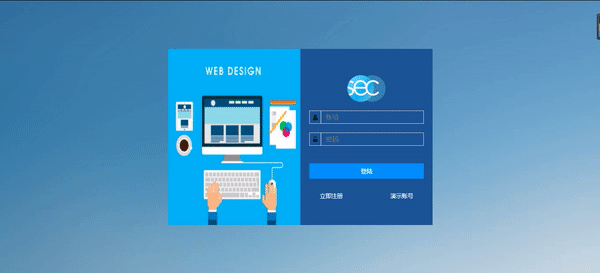
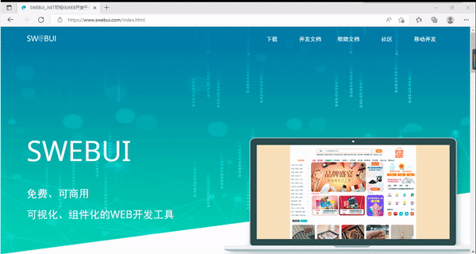
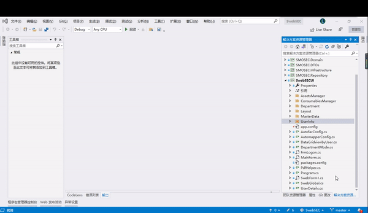
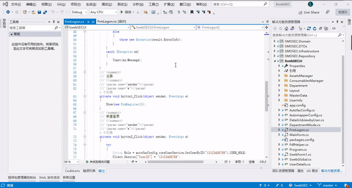

##  SwebSEC
### 资产管理系统

项目包含资产、耗材两种类型资产的管理功能，由部门管理、区域管理、盘点、标签打印、出入库等核心功能组成。 

      

### 源代码运行环境要求

.NET FrameWork版本: .支持NET FrameWork 4.5及以上版本  
Visual Studio版本：支持Visual studio 2012及以上版本  
服务器系统：支持Linux、windows 8.1及windows server 2012以上版本
SwebDesigner版本：最新版([下载并安装SwebDesigner](https://www.swebui.com/SwebuiDesigner.exe)) 

### 在线演示项目

地址：https://smosec.swebui.com/

测试账号 13123456789 密码 123456 （或者直接点击演示账号）

### 打开项目

确认.NET FrameWork已安装且版本正确。   
确认Visual Studio已安装且版本正确。   
确认SwebDesigner已安装且版本正确。   
下载源码，在VisualStudio中打开。

### 调试
 
在Visual studio 点击“启动“。   
浏览器访问127.0.0.1:http端口 (默认端口号为2380)

### 相关资料

1. 点击查看SWEBUI Designer下载(https://www.swebui.com/download.html)
2. 点击查看一键学习(https://www.swebui.com/guide/quickstart.aspx)
3. 点击查看SWEBUI官网 (https://www.swebui.com/index.html)
4. 若出现图标无法显示的情况，是因为开启了防火墙，点击查看设置(http://www.smobiler.com/forum.php?mod=viewthread&tid=12)
5. QQ技术交流群：721955851

